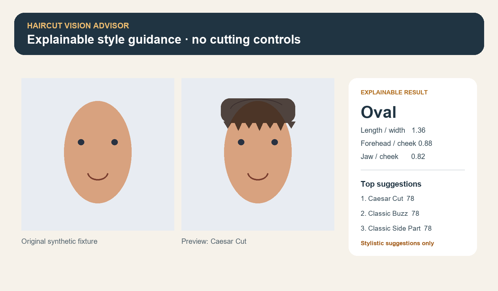

# Haircut Vision Advisor

An explainable competition prototype that turns a webcam snapshot or uploaded
portrait into approximate face proportions, a face-shape estimate, ranked
hairstyle suggestions, a simple visual preview, and a selected-style JSON
contract for a separate robotics subsystem.

> **Safety boundary:** this project does not control motors, blades, clippers,
> paths, forces, or safety interlocks. Its JSON output is descriptive metadata
> only. A physical haircut system needs independent engineering controls,
> professional review, fail-safe hardware, and explicit user confirmation.



## What the MVP does

- Accepts a browser camera snapshot or uploaded JPG/PNG.
- Uses the supported MediaPipe Tasks Face Landmarker API (478 landmarks).
- Calculates normalized face length, forehead, cheekbone, and jaw widths.
- Applies visible, deterministic heuristics for oval, round, square, oblong,
  heart, and diamond labels, including a confidence/ambiguity indication.
- Ranks 15 configurable styles using face shape and user preferences.
- Explains every recommendation score.
- Draws an original programmatic silhouette preview—no third-party hair art.
- Exports only a validated robot-integration JSON contract after selection.

## Quick start

MediaPipe currently requires a supported Python wheel. Use Python 3.11 or 3.12
(64-bit); Python 3.13+ is intentionally excluded by this project.

```powershell
python -m venv .venv
.\.venv\Scripts\Activate.ps1
python -m pip install --upgrade pip
pip install -e ".[dev]"
python scripts/download_face_landmarker.py
streamlit run app.py
```

On macOS/Linux, activate with `source .venv/bin/activate`. The model download
script fetches Google's `face_landmarker.task` asset and verifies that a
non-empty file was received. You may instead set `FACE_LANDMARKER_MODEL` to an
existing compatible model path.

The browser UI opens at `http://localhost:8501`. If camera permissions are not
available, choose **Upload image**. For the quickest no-photo walkthrough,
choose **Demo fixture**; it uses synthetic landmarks and never pretends that a
real face was analyzed. Competition presenters can launch directly into that
mode at `http://localhost:8501/?demo=1`.

## Test and quality commands

```powershell
pytest
ruff check .
```

Tests cover measurements, classification boundaries, ranking, catalog quality,
preview rendering, and robot-contract validation. They do not require the
MediaPipe model file.

## Project map

```text
app.py                       Streamlit competition UI
assets/hairstyles.json       Configurable 15-style catalog
models/                      Local model location (binary is gitignored)
scripts/download_face_landmarker.py
src/haircut_vision/          Vision, heuristics, ranking, preview, contract
tests/                       Unit and integration-style tests
docs/ARCHITECTURE.md
docs/SAFETY_AND_LIMITATIONS.md
docs/DEVELOPMENT_LOG.md
```

See [Architecture](docs/ARCHITECTURE.md) for data flow and
[Safety and limitations](docs/SAFETY_AND_LIMITATIONS.md) before any integration.
